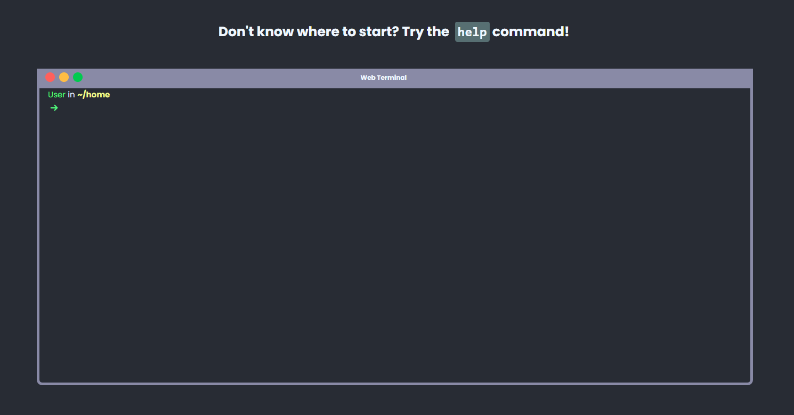

<h1 align="center" id="title">Terminal Web Portifolio</h1>

<p id="description">A terminal-like website with custom commands that simulates the use of a linux terminal inside the browser.</p>

<h2>🚀 Demo</h2>

[https://franciscogsilverio.github.io/Terminal-WebPortfolio/](https://franciscogsilverio.github.io/Terminal-WebPortfolio/)

<h2>Project Screenshots:</h2>



  
  
<h2>🧐 Features</h2>

Here're some of the project's best features:

*   Screen responsivity
*   Animations
*   Http requests with React-query
*   CSS in Js with Styled Components
*   Automated tests with Jest and React Testing Library

<h2>🛠️ Installation Steps:</h2>

<p>1. Clone the repository</p>

```
git clone https://github.com/FranciscoGSilverio/Terminal-WebPortfolio.git
```

<p>2. Change the directory to the terminal</p>

```
cd terminal
```

<p>3. Install the dependecies</p>

```
npm install
```

<p>4. Start the app</p>

```
npm start
```

  
  
<h2>💻 Built with</h2>

Technologies used in the project:

*   React
*   Typescript
*   React-query
*   Styled-components
*   Context-API
*   GitHub API
